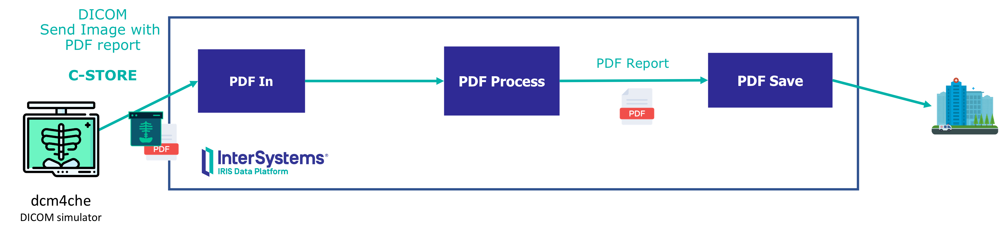
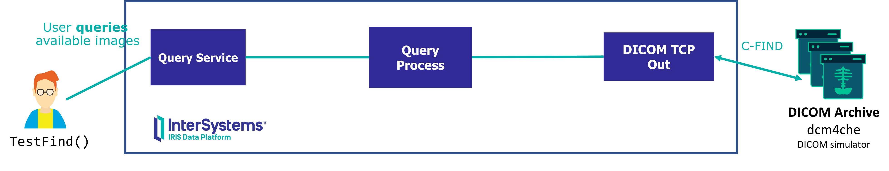
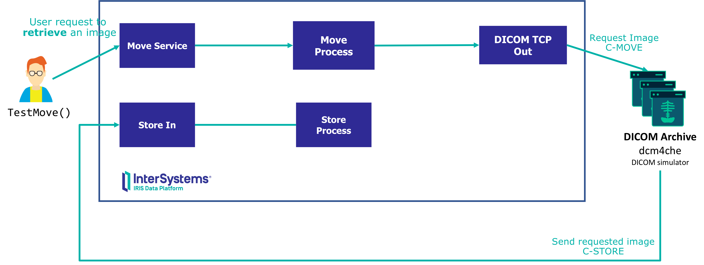
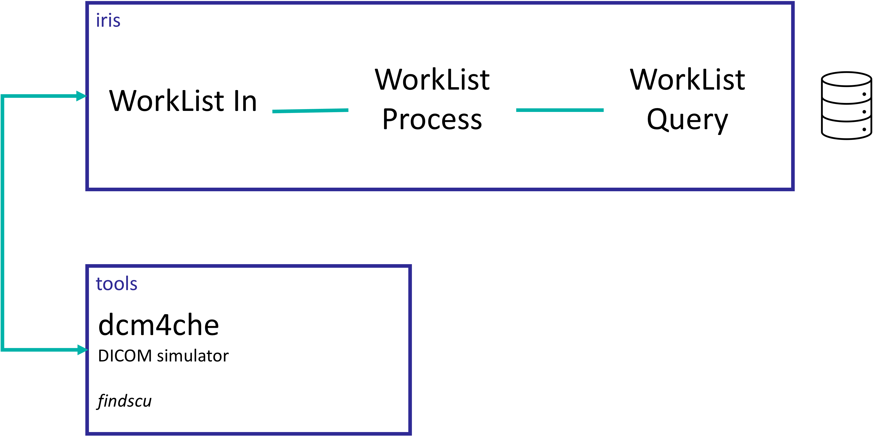

# 🧪 Simple DICOM Integration with InterSystems IRIS for Health + dcm4che Simulator

[](./LICENSE)  
[](https://www.docker.com/)  
[](https://code.visualstudio.com/)  
[](#)  
[](https://www.intersystems.com/iris)

This repository provides hands-on examples of DICOM integration using **InterSystems IRIS for Health** and the **dcm4che DICOM simulator**.

You'll find:
- A working IRIS production for handling DICOM messages  
- Tools to simulate common DICOM workflows (store, query, retrieve)  
- A sample WorkList scenario integrated with a MySQL database  

Perfect for testing, learning, or building healthcare imaging integrations.

---

## 🧰 Requirements

To run this project, you’ll need:

- [Git](https://git-scm.com/downloads)  
- [Docker](https://www.docker.com/products/docker-desktop) + [Docker Compose](https://docs.docker.com/compose/install/)  
  ⚠️ On **Windows**, make sure Docker is using **Linux containers**  
- [Visual Studio Code](https://code.visualstudio.com/download) with [InterSystems ObjectScript Extension Pack](https://marketplace.visualstudio.com/items?itemName=intersystems-community.objectscript-pack)

---

## 🚀 Getting Started

Once you’ve got Docker installed, you can get up and running with:

```bash
docker-compose build
docker-compose up -d
```

That's it — you're ready to dive in!

---

## 🧭 Explore the IRIS Production

Open the DICOM production interface in your browser:

👉 [DICOM.Production](http://localhost:52773/csp/user/EnsPortal.ProductionConfig.zen?PRODUCTION=DICOM.Production&$NAMESPACE=USER)  
🔐 Credentials: `superuser` / `SYS`

---

## 📥 Use Case 1: Receiving DICOM with Embedded PDF

**Description**: A DICOM file containing a PDF report is received by IRIS. The system extracts metadata from the DICOM header (e.g. patient name, study ID) and stores both the PDF and metadata in another system (like an EHR or document store).



### How to run it:

1. Open a shell in the tools container:
   ```bash
   docker exec -it tools bash
   ```

2. Generate a DICOM file with embedded PDF:
   ```bash
   ./pdf2dcm -f /shared/pdf/metadata.xml -- /shared/pdf/sample.pdf /shared/pdf/embeddedpdf.dcm
   ```

3. Send it to IRIS:
   ```bash
   ./storescu -b DCM_PDF_SCP -c IRIS_PDF_SCU@iris:2010 /shared/pdf/embeddedpdf.dcm
   ```

4. 📨 Check the messages in IRIS:  
   👉 [Message Viewer](http://localhost:52773/csp/user/EnsPortal.MessageViewer.zen)

---

## 🔍 Use Case 2: Query / Retrieve (C-FIND / C-MOVE)

**Description**: IRIS queries a PACS using a DICOM C-FIND to locate imaging studies, then uses C-MOVE to retrieve one of the matching documents.

### Querying with C-FIND



1. Open the tools container:
   ```bash
   docker exec -it tools bash
   ```

2. Inspect a DICOM file:
   ```bash
   ./dcmdump /shared/dicom/d1I00001.dcm
   ```

3. Create the DICOMDIR database:
   ```bash
   ./dcmdir -c /shared/DICOMDIR --fs-id SAMPLEDICOMS --fs-desc /shared/dicom/descriptor /shared/dicom
   ```

4. Start the simulated archive:
   ```bash
   ./dcmqrscp --ae-config /shared/ae.properties -b DCM_QRY_SCP:3010 --dicomdir /shared/DICOMDIR
   ```

5. Connect to IRIS:
   ```bash
   docker exec -it iris bash
   iris session iris
   ```

6. Run the C-FIND:
   ```objectscript
   do ##class(DICOM.BS.QueryService).TestFind()
   ```

   👉 View results in [QueryService Messages](http://localhost:52773/csp/user/EnsPortal.MessageViewer.zen?SOURCEORTARGET=QueryService)

### Retrieving with C-MOVE



7. Request a study using C-MOVE:
   ```objectscript
   do ##class(DICOM.BS.MoveService).TestMove()
   ```

   👉 Track the transfer:  
   [MoveService](http://localhost:52773/csp/user/EnsPortal.MessageViewer.zen?SOURCEORTARGET=MoveService) |  
   [DICOM Store In](http://localhost:52773/csp/user/EnsPortal.MessageViewer.zen?SOURCEORTARGET=DICOM%20Store%20In)

---

## 📋 Use Case 3: WorkList Management (C-FIND + SQL)

**Description**: An imaging device sends a C-FIND request to IRIS to retrieve scheduled studies. IRIS queries an external MySQL database, builds the WorkList response, and sends it back.



### 🛢️ Check the external MySQL WorkList DB

1. Enter the MySQL container:
   ```bash
   docker exec -it mysql bash
   mysql --host=localhost --user=testuser testdb -p  # Password: testpassword
   ```

2. View WorkList data:
   ```sql
   SELECT * FROM WorkList;
   ```

### 📡 Request the WorkList using C-FIND

1. Open the tools container:
   ```bash
   docker exec -it tools bash
   ```

2. Send a WorkList query:
   ```bash
   ./findscu -b DCM_WL -c IRIS_WL@iris:1112 -m StudyDate=20250404
   ```

### 🧠 See how IRIS handled it

👉 Check [DICOM WL Find In Messages](http://localhost:52773/csp/user/EnsPortal.MessageViewer.zen?SOURCEORTARGET=DICOM%20WL%20Find%20In)

---

## 🎉 You're All Set!

You now have a fully working, simulated DICOM integration lab using IRIS for Health and dcm4che. Use it to learn, test, build prototypes — and have fun doing it!

---

## 📚 Learn More

- [🧠 InterSystems Learning Portal](https://learning.intersystems.com)
- [📦 dcm4che DICOM Tools](https://github.com/dcm4che/dcm4che)
- [💡 IRIS for Health](https://www.intersystems.com/iris-for-health/)
