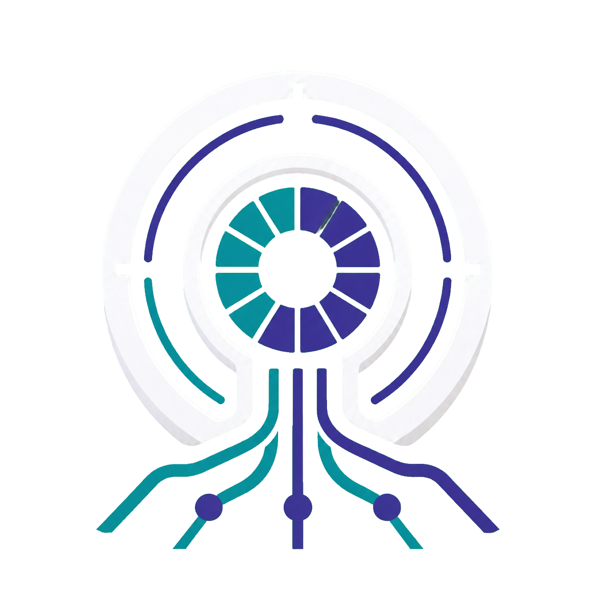
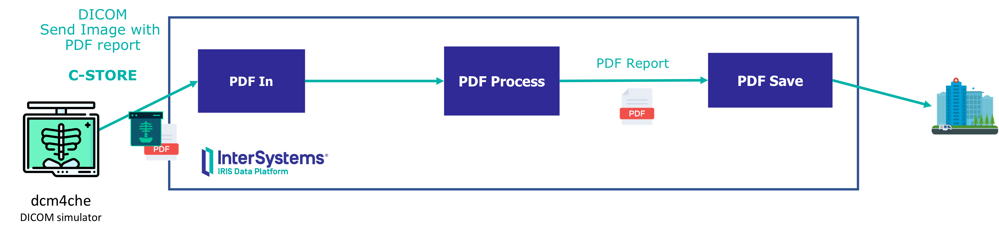
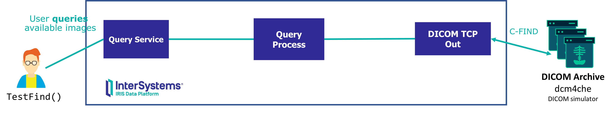
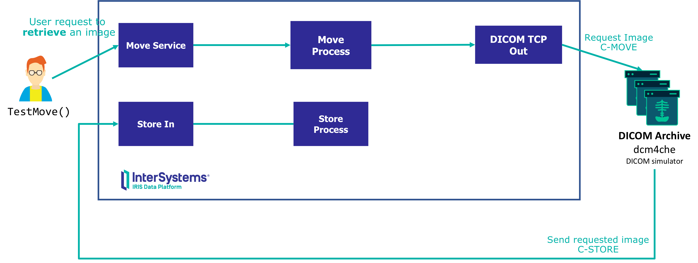
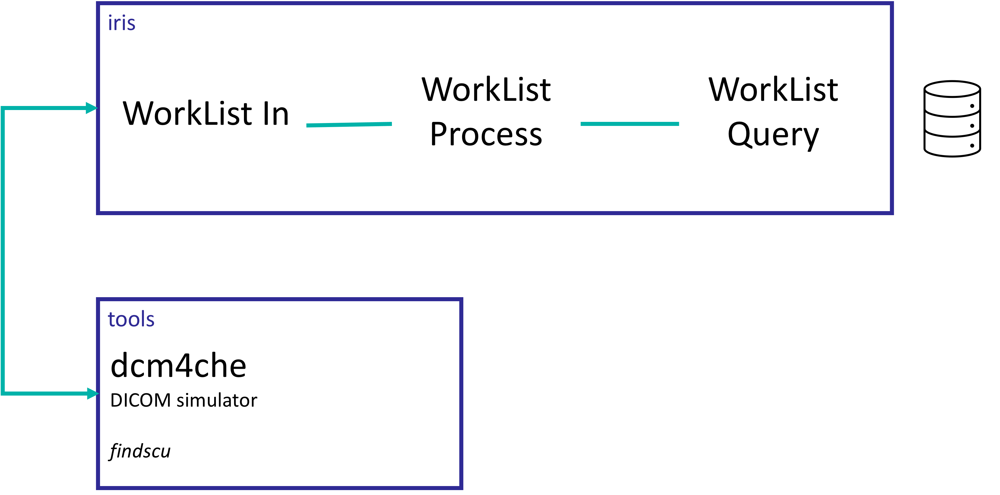
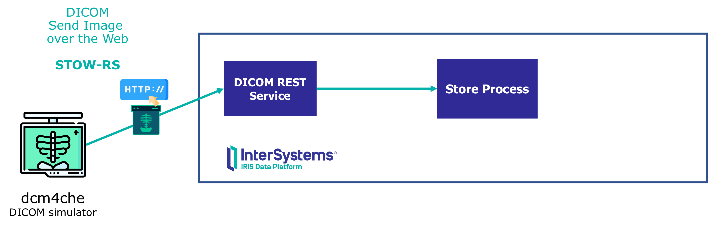

<h1 align="center">
  
  DICOM Integration with InterSystems IRIS for Health
</h1>

<p align="center">dcm4che simulator · DICOM interoperability workshop</p>

<p align="center">
  <a href="./LICENSE"></a>
  <a href="https://www.docker.com/"></a>
  <a href="https://code.visualstudio.com/"></a>
  <a href="#"></a>
  <a href="https://www.intersystems.com/iris"></a>
</p>

This repository provides hands-on examples of DICOM integration using **InterSystems IRIS for Health** and the **dcm4che DICOM simulator**.

You'll find:
- A working IRIS production for handling DICOM messages  
- Tools to simulate common DICOM workflows (store, query, retrieve)  
- A sample WorkList scenario integrated with a MySQL database  

Perfect for testing, learning, or building healthcare imaging integrations.

## What you'll learn

| Use case | DICOM interaction | Integration outcome |
| --- | --- | --- |
| Embedded PDF | C-STORE | IRIS receives a DICOM document and extracts its metadata. |
| Query / Retrieve | C-FIND and C-MOVE | IRIS locates a study in a simulated archive and retrieves it. |
| WorkList | Modality Worklist C-FIND | IRIS queries MySQL and returns scheduled procedure steps. |
| Store over the Web | STOW-RS | IRIS accepts DICOM over HTTP and forwards it to a DICOM receiver. |

> **DICOM vocabulary:** An **AE Title** is a DICOM application's name. An **SCU** sends a request and an **SCP** receives it. **C-FIND** searches for matching records, **C-MOVE** requests a transfer, **Modality Worklist** supplies scheduled imaging work, and **STOW-RS** stores DICOM objects over HTTP.

---

## 🧰 Requirements

To run this project, you’ll need:

- [Git](https://git-scm.com/downloads)  
- [Docker Desktop](https://www.docker.com/products/docker-desktop), including Docker Compose
  ⚠️ On **Windows**, make sure Docker is using **Linux containers**  

Optional, for browsing and editing the ObjectScript source:

- [Visual Studio Code](https://code.visualstudio.com/download) with [InterSystems ObjectScript Extension Pack](https://marketplace.visualstudio.com/items?itemName=intersystems-community.objectscript-pack)

---

## 🚀 Getting Started

Once you’ve got Docker installed, build and start the lab with:

```bash
docker compose up -d --build
```

Confirm that the three services are running before starting a use case:

```bash
docker compose ps
```

You should see `iris`, `tools`, and `mysql` running. That's it — you're ready.

---

## Explore the IRIS Production

Open the DICOM production interface in your browser:

[DICOM.Production](http://localhost:52773/csp/user/EnsPortal.ProductionConfig.zen?PRODUCTION=DICOM.Production&$NAMESPACE=USER)
Credentials: `superuser` / `SYS`

---

## 📥 Use Case 1: Receiving DICOM with Embedded PDF

A DICOM file containing a PDF report is received by IRIS. The system extracts metadata from the DICOM header (e.g. patient name, study ID) and stores both the PDF and metadata in another system (like an EHR or document store).



### How to run it:

1. Open a shell in the tools container:
   ```bash
   docker exec -it tools bash
   ```

2. Generate a DICOM file with embedded PDF:
   ```bash
   ./pdf2dcm -f /shared/pdf/metadata.xml -- /shared/pdf/sample.pdf /shared/pdf/embeddedpdf.dcm
   ```

3. Send it to IRIS:
   ```bash
   ./storescu -b DCM_PDF_SCP -c IRIS_PDF_SCU@iris:2010 /shared/pdf/embeddedpdf.dcm
   ```

4. Check the messages in IRIS:
   [Message Viewer](http://localhost:52773/csp/user/EnsPortal.MessageViewer.zen)

**Expected outcome:** A new inbound DICOM message appears in the IRIS Message Viewer.

---

## 🔍 Use Case 2: Query / Retrieve (C-FIND / C-MOVE)

IRIS queries a PACS using a DICOM C-FIND to locate imaging studies, then uses C-MOVE to retrieve one of the matching documents.

### Querying with C-FIND



1. Open the tools container:
   ```bash
   docker exec -it tools bash
   ```

2. Inspect a DICOM file:
   ```bash
   ./dcmdump /shared/dicom/d1I00001.dcm
   ```

3. Create the DICOMDIR database:
   ```bash
   ./dcmdir -c /shared/DICOMDIR --fs-id SAMPLEDICOMS --fs-desc /shared/dicom/descriptor /shared/dicom
   ```

4. Start the simulated archive:
   ```bash
   ./dcmqrscp --ae-config /shared/ae.properties -b DCM_QRY_SCP:3010 --dicomdir /shared/DICOMDIR
   ```

   > This command keeps the terminal busy. Leave it running, then open a second terminal for the next steps.

5. In a second terminal, connect to IRIS:
   ```bash
   docker exec -it iris bash
   iris session iris
   ```

6. Run the C-FIND:
   ```objectscript
   do ##class(DICOM.BS.QueryService).TestFind()
   ```

   View results in [QueryService Messages](http://localhost:52773/csp/user/EnsPortal.MessageViewer.zen?SOURCEORTARGET=QueryService)

   **Expected outcome:** IRIS sends a C-FIND request and records matching study information in the Message Viewer.

### Retrieving with C-MOVE



7. Request a study using C-MOVE:
   ```objectscript
   do ##class(DICOM.BS.MoveService).TestMove()
   ```

   Track the transfer:
   [MoveService](http://localhost:52773/csp/user/EnsPortal.MessageViewer.zen?SOURCEORTARGET=MoveService) | [DICOM Store In](http://localhost:52773/csp/user/EnsPortal.MessageViewer.zen?SOURCEORTARGET=DICOM%20Store%20In)

   **Expected outcome:** The selected study is transferred from the simulated archive to IRIS as DICOM C-STORE messages.

---

## 📋 Use Case 3: WorkList Management (C-FIND + SQL)

**Description**: An imaging device sends a C-FIND request to IRIS to retrieve scheduled studies. IRIS queries an external MySQL database, builds the WorkList response, and sends it back.



### Check the external MySQL WorkList DB

1. Enter the MySQL container:
   ```bash
   docker exec -it mysql bash
   mysql --host=localhost --user=testuser testdb -p  # Password: testpassword
   ```

2. View WorkList data:
   ```sql
   SELECT * FROM WorkList;
   ```

### Request the WorkList using C-FIND

1. Open the tools container:
   ```bash
   docker exec -it tools bash
   ```

2. Send a WorkList query:
   ```bash
   ./findscu -b DCM_WL -c IRIS_WL@iris:1112 -M MWL -m ScheduledProcedureStepSequence.ScheduledProcedureStepStartDate=20250404
   ```

   This sends a real Modality Worklist C-FIND request using SOP class `1.2.840.10008.5.1.4.31`.

   **Expected outcome:** The fixed demo date returns three scheduled entries: `DEMO001`, `DEMO002`, and `DEMO003`.

### See how IRIS handled it

Check [DICOM WL Find In Messages](http://localhost:52773/csp/user/EnsPortal.MessageViewer.zen?SOURCEORTARGET=DICOM%20WL%20Find%20In)


---

## 🌐 Use Case 4: Store Document over the Web

An imaging device sends an image over HTTP using a STOW-RS (HTTP POST) request to IRIS, which receives, extracts, and processes the DICOM image.



1. Open the tools container:
   ```bash
   docker exec -it tools bash
   ```
2. Run a simulated listener for incoming C-STORE:
   ```bash
   ./storescp -b DCM_STORE_SCP:4010 --response-delay 5000
   ```

   This command keeps the terminal busy. Leave it running, then open a second terminal for the STOW-RS request.

3. In a second terminal, send DICOM images using STOW-RS:
   ```bash
   ./stowrs --url http://iris:52773/dicom/studies /shared/dicom/d1I00001.dcm /shared/dicom/d1I00002.dcm /shared/dicom/d1I00003.dcm
   ```

4. In IRIS, check the received message in the [DICOM REST Service Messages](http://localhost:52773/csp/user/EnsPortal.MessageViewer.zen?SOURCEORTARGET=DICOM%20REST%20Service)

**Expected outcome:** IRIS receives the STOW-RS request, and the simulated listener receives the forwarded DICOM C-STORE messages.

---

## You're All Set!

You now have a fully working, simulated DICOM integration lab using IRIS for Health and dcm4che. Use it to learn, test and build prototypes.

### Stop the lab (optional)

```bash
docker compose down
```

---

## Securing DICOM with TLS

Want to add mutual TLS (mTLS) authentication to your DICOM communications?

Check out the [TLS Setup Guide](TLS.md) for step-by-step instructions on creating certificates and configuring secure connections between SCU clients and IRIS.

---

## Learn More

- [InterSystems Learning Portal](https://learning.intersystems.com)
- [📦 dcm4che DICOM Tools](https://github.com/dcm4che/dcm4che)
- [💡 IRIS for Health](https://www.intersystems.com/iris-for-health/)
